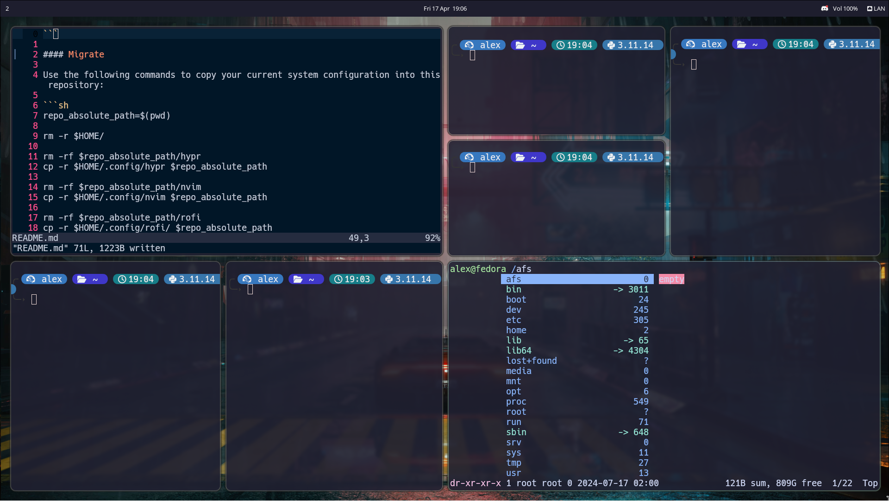
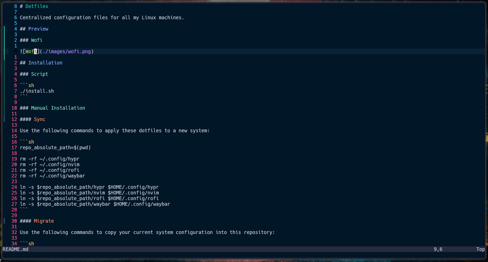
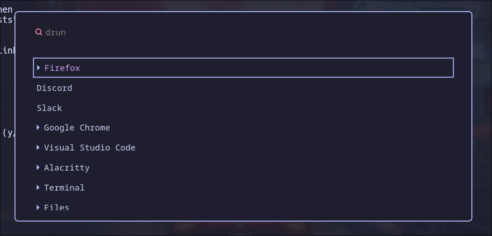

# Dotfiles

Centralized configuration files for all my Linux machines.

## Preview

### Hyprland



### Waybar


### Neovim



### Wofi



## Installation

### Script

```sh
./install.sh
```

### Manual Installation

#### Sync

Use the following commands to apply these dotfiles to a new system:

```sh
repo_absolute_path=$(pwd)

rm -rf ~/.config/hypr
rm -rf ~/.config/nvim
rm -rf ~/.config/rofi
rm -rf ~/.config/waybar

ln -s $repo_absolute_path/hypr $HOME/.config/hypr
ln -s $repo_absolute_path/nvim $HOME/.config/nvim
ln -s $repo_absolute_path/rofi $HOME/.config/rofi
ln -s $repo_absolute_path/waybar $HOME/.config/waybar
```

#### Migrate

Use the following commands to copy your current system configuration into this repository:

```sh
repo_absolute_path=$(pwd)

rm -r $HOME/

rm -rf $repo_absolute_path/hypr
cp -r $HOME/.config/hypr $repo_absolute_path

rm -rf $repo_absolute_path/nvim
cp -r $HOME/.config/nvim $repo_absolute_path

rm -rf $repo_absolute_path/rofi
cp -r $HOME/.config/rofi/ $repo_absolute_path

rm -rf $repo_absolute_path/waybar
cp -r $HOME/.config/waybar/ $repo_absolute_path
```
